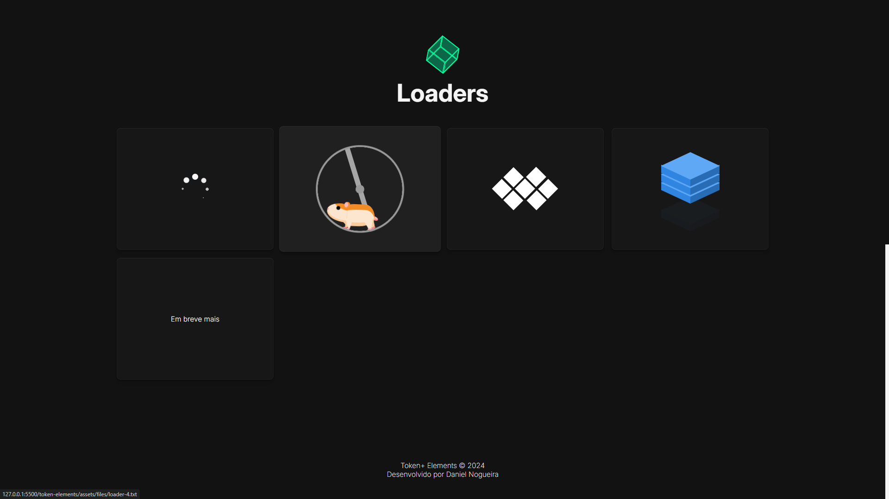
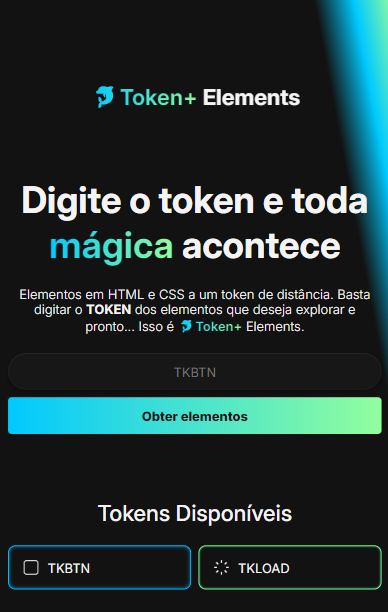
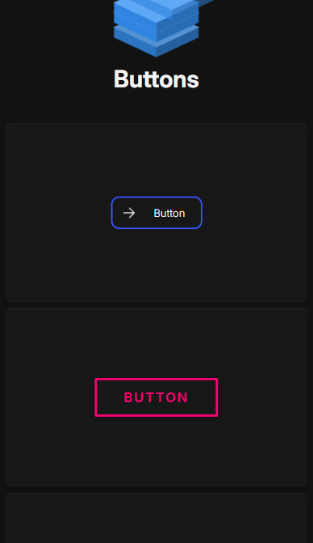

<div align="center">
  <h1>🐬 Token+ Elements</h1>
  
  
  
  
  
  
  <p>Elementos em HTML e CSS a um token de distância, isso é 🐬Token+ Elements.</p>
</div>

## Sumário

- [Sobre](#about)
- [Preview](#preview)
- [Tecnologias](#built-with)
- [Funcionalidades](#key-features)
- [Deploy](#deploy)
- [Destaques](#highlights)
- [Meu Contato](#contact)
<!-- - [Etapas de Criação](#developing) -->

<h2 id="about">Sobre</h2>

Insira ou clique em um token, escolha seu elemento preferido e veja o código HTML e CSS dele.


<h2 id="preview">Preview</h2>

Desktop Preview




<br>

Mobile Preview




<h2 id="built-with">Tecnologias</h2>

- JavaScript
- HTML
- CSS

<h2 id="key-features">Funcionalidades</h2>

- [x] Inserir ou clicar em um token
- [x] Visualizar elementos do token escolhido
- [x] Visualizar código HTML e CSS do elemento

<h2 id="deploy">Deploy</h2>

[Token+ Elements](https://token-elements.vercel.app/)

<!-- <h2 id="developing">Etapas de Criação</h2>

### Primeira Etapa: Criação do HTML e CSS

A partir de uma noção dos fundamentos de HTML e CSS que já tenho e foi reforçada nas aulas, essa foi uma etapa confortável. Na qual criei dentro do `body` uma div `container` que agrupa as `sections` do projeto, decidi usar as propriedades de `display: grid` e `display: flex` para manter uma boa responsividade no futuro.

O Gemini teve parte no momento de me dar detalhes do `display: grid`, não é algo tão trivial de se ter memorizado na cabeça sempre. Também usei algumas variáveis CSS no `root` da aplicação pra configurar o projeto, por mais que não seja algo abordado nas aulas, é simples de fazer e facilita muito meu entendimento do design do projeto.

#### PROMPTS USADOS NO GEMINI

```
Como fazer um elemento dentro de um container com display: grid ocupar todo o espaço disponível?
```

```
Como centralizar elementos que pertencem a um container definido como display grid?
```

### Segunda Etapa: Criação do Script Inicial

Me deparei com um primeiro desafio, acessar uma variável que estava no arquivo `dados.js` e usá-la no arquivo `app.js`, por mais que já tivesse tido contato com JavaScript antes, essa foi minha primeira vez criando e usando e uma base de dados.

Primeiro perguntei ao Gemini como importar um arquivo `.js` para outro arquivo `.js`, mas vi que esse não era o caminho... Até que finalmente, também com a ajuda das aulas, consegui resolver.

#### PROMPTS USADOS NO GEMINI

```
Estou obtendo esse erro: SyntaxError: Cannot use import statement outside a module
```

```
Como usar uma variável que está em dados.js no arquivo app.js?
```

### Terceira Etapa: Animações e Efeitos

Sempre acessava alguns sites que possuíam animações de elementos na página quando eles apareciam, até que decici perguntar ao Gemini para ver qual resposta ele dava, e lá estava.

Com 14 linhas de código apenas, o Gemini gerou um exemplo de animação com `keyframes` que foi fundamental pra animar alguns elementos no projeto. Achei que seria muito mais difícil, mas era tão simples que consegui adicionar na aplicação.

Também queria adicionar um efeito brilhante nos botões do token, e novamente perguntei ao Gemini. Com algumas poucas linhas de código gerado pela IA do Gemini, consegui deixar os botões com o aspecto interessante que eu queria.

Além disso, a Gemini gerou um trecho de código de CSS que não entendi muito bem o que ele fazia, então decidi perguntar sobre aquele trecho e fui respondido.

#### PROMPTS USADOS NO GEMINI

```
Como fazer uma borda de botão com efeito brilhante no css?
```

```
Como fazer uma animação de um elemento html subindo e descendo com css?
```

```
box-shadow: inset 0px 2px 4px rgba(11, 142, 230, 1); O que esse código faz?
```

### Quarta Etapa: Scripts Avançados

Aqui foi essencial assistir às aulas do curso porque realmente eu nunca tinha tido a necessidade de usar uma base de dados pronta e adicionar no HTML mediante uma barra de pesquisa, foi algo novo pra mim e foi o ponto chave da Imersão. Os instrutores foram essenciais, bem como o uso do Gemini.

O conteúdo de como fazer isso nas aulas foi muito bem explicitado, mas fiquei curioso de como a barra de pesquisa também poderia chamar a função ao apertarmos a tecla `ENTER`, perguntei ao Gemini e lá estava a resposta.

E para o meu projeto, era necessário saber como abrir uma página ao clicar em um elemento específico, nesse ponto o Gemini acabou me apresentando uma solução um pouco mais complexa do que o necessário, mas foi válida.

Aqui também pedi ajuda ao Gemini para implementar o recebimento do valor de `input` do HTML.

#### PROMPTS USADOS NO GEMINI

```
Como chamar uma função em js quando uma tecla ENTER em um imput é pressionada?
```

```
Um código que ao clicar em uma div html eu seja redirecionado para uma página
```

```
Como receber o valor de um input do html?
```

### Quinta Etapa: Tela de Carregamento

Para dar um charme ao iniciar a aplicação, pensei em simular uma tela de carregamento antes de abrir a página principal na tela. Fiquei surpreso com a resposta do Gemini, ele gerou o código HTML, CSS e JavaScript necessário.

A função `setTimeout` foi a função sugerida pelo Gemini para realizar tal feito, uma única linha e ela consegue operar o tempo de atraso da exibição de um código para o outro. O mais legal foi o Gemini comentando cada novo conceito apresentado nas linhas de código, o que facilitou demais o entendimento.

#### PROMPT USADO NO GEMINI

```
Como seria um código html com js para que eu exibisse uma tela de carregamento e depois abrisse a página principal?
``` -->

<h2 id="highlights">Destaques</h2>

Criação de tela de carregamento

```html
<div class="loading">
  <div class="loading__spin"></div>
  <p class="loading__text"></p>
</div>
```

```js
function carregar() {
  const loading = document.querySelector('.loading');
  const container = document.querySelector('.container');
  const loading__text = document.querySelector('.loading__text');

  setTimeout(esconder, 1490);
  function esconder() {
    loading.style.display = 'none';
  }

  setTimeout(exibir, 1500);
  function exibir() {
    container.style.display = 'grid';
  }

  loading__text.innerText = 'Um elemento?';
  setTimeout(() => {
    loading__text.innerText = 'Calma aí...';
  }, 800);

  function esconder() {
    loading.style.display = 'none';
  }
}
```

<br>

Inserções de HTML via JavaScript

```js
function exibirObjetoBtn() {
  objeto.innerHTML = `<div class="loader-5">
    <div class="box box-1">
      <div class="side-left"></div>
      <div class="side-right"></div>
      <div class="side-top"></div>
    </div>
    <div class="box box-2">
      <div class="side-left"></div>
      <div class="side-right"></div>
      <div class="side-top"></div>
    </div>
    <div class="box box-3">
      <div class="side-left"></div>
      <div class="side-right"></div>
      <div class="side-top"></div>
    </div>
    <div class="box box-4">
      <div class="side-left"></div>
      <div class="side-right"></div>
      <div class="side-top"></div>
    </div>
  </div>`;
}
```

<br>

Event Listener da tecla ENTER no campo de Token

```js
input.addEventListener('keypress', function (event) {
  if (event.key === 'Enter') {
    exibirElementos();
  }
});
```

<h2 id="contact">Meu Contato</h2>

LinkedIn [@udanielnogueira](https://www.linkedin.com/in/udanielnogueira/)
